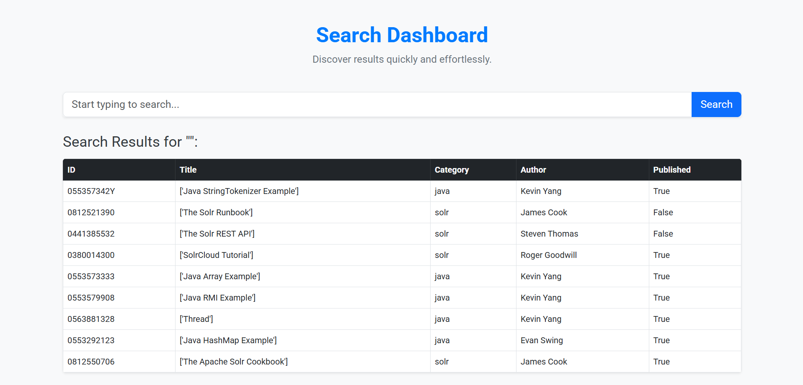

---

# 🔎 Search Dashboard

A modern web-based search application that allows users to **quickly search** and **discover** data from an Apache Solr backend.  
Features real-time **autocomplete suggestions** and **filtered search results** based on Title, Category, and Author fields.



---

## ✨ Features
- 🔍 Instant search across Titles, Categories, and Authors.
- 🧠 Smart Autocomplete — only shows **relevant matching suggestions**.
- ⚡ Fast, efficient, and lightweight.
- 🎯 Clean, user-friendly interface with a responsive design.
- 🔗 Powered by **Apache Solr** search backend.

---

## 🛠 Tech Stack
- **Frontend:** HTML, CSS, JavaScript (Fetch API, Autocomplete)
- **Backend:** Python (Flask)
- **Search Engine:** Apache Solr
- **Database:** (Handled internally by Solr)

---

## 🚀 Setup Instructions

1. **Clone the repository:**
   ```bash
   git clone https://github.com/your-username/your-repo.git
   cd your-repo
   ```

2. **Install required Python packages:**
   ```bash
   pip install flask requests
   ```

3. **Configure Solr connection:**
   - Set your Solr Base URL inside `app.py`:
     ```python
     SOLR_BASE_URL = "http://localhost:8983/solr/your-core-name"
     ```

4. **Run the Flask App:**
   ```bash
   python app.py
   ```

5. **Access the Dashboard:**
   Open your browser and go to:
   ```
   http://localhost:5000
   ```

---

## 🧩 Project Structure

```
├── static/
│   ├── css/
│   └── js/
├── templates/
│   └── index.html
├── app.py
└── README.md
```

---

## 🔥 How it Works
- When the user types in the search bar, the app sends a **real-time request** to Solr via Flask backend.
- The autocomplete feature suggests only **matching fields** (Title, Category, Author).
- Upon search submission, all matching records are fetched and displayed in a clean, responsive table.

---

## 🛡️ License
This project is licensed under the MIT License - feel free to use and modify!

---

## 🤝 Contributing
Pull requests are welcome! For major changes, please open an issue first to discuss what you would like to change.

---

# 📬 Contact
If you like this project, give it a ⭐!  
For any questions or collaboration requests, feel free to reach out.

---
